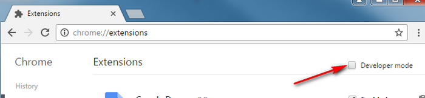

## Install an unreleased version

Sometimes, you want to use a version not available on the stores yet, or a beta version because a developer asked you. This version **WILL NOT** be updated automatically by your browser.
If you're really sure you want to do it anyway, you can follow these steps:

### For Firefox

1. Download [the last pre-release ZIP file package](https://github.com/wallabag/wallabagger/releases)
2. Go to the extension debbuging page: `about:addons`
3. Click on the cog icon then `Install Add-on From File`
4. Select the ZIP file you downloaded

### For Chromium-based browsers (Chrome, Vivaldi)

1. Download [the last pre-release CRX file](https://github.com/wallabag/wallabagger/releases)
2. Go to your browser's extension settings page
    - Chrome: `chrome://extensions/`
    - Vivaldi: `vivaldi:extensions`
    - Brave: `brave://extensions/`
3. Enable the developer mode (toggle on the top right corner)

4. Drag 'n drop the CRX file to this page
5. Accept to install it

## Install the last work in progress version, should be stable, but not ready for production (**Really not recommended**)

1. Download [the last version of the source code](https://github.com/wallabag/wallabagger/archive/refs/heads/main.zip)
2. Unzip this file
3. Follow the steps 2 and 3 of the previous section
4. Select the wallabagger folder (containing the *manifest.json* file)

## Beta versioning number

Look at the [versioning page](versioning) to get info about releases version numbers.
