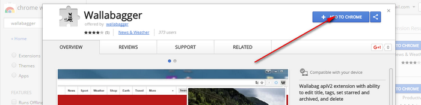

## Installation

### For Firefox

#### From the Firefox Add-ons page

1. Open [the addon page](https://addons.mozilla.org/firefox/addon/wallabagger/)
2. Click on the `Add to Firefox` button (if you want the addon to work on private mode, don't forget to check the box on the popin displayed after this step)

### For Chromium-based browsers (Chrome, Vivaldi, Brave, Edge, Yandex browser…)

#### From the Chrome Web Store

1. Open [the extension page](https://chrome.google.com/webstore/detail/wallabagger/gbmgphmejlcoihgedabhgjdkcahacjlj)
2. Click on the `Add to Chrome` button

### Install an unreleased version (**Testing purpose only**)

If you want to help us and try testing version, you can look at [the testing page](betatest).
