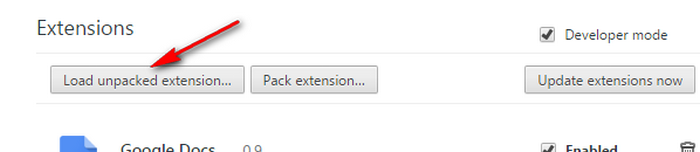

## Installation

### For Firefox

#### From the Firefox Add-ons page

1. Open [the addon page](https://addons.mozilla.org/firefox/addon/wallabagger/)
2. Click on the `Add to Firefox` button (if you want the addon to work on private mode, don't forget to check the box on the popin displayed after this step)

#### Use unpacked source

1. Download source from or clone [the github repository](https://github.com/wallabag/wallabagger)
2. Go to [the extension debbuging page](about:debugging#/runtime/this-firefox)
3. Click on the `Load temporary module` button
5. Select the wallabagger folder (containing the *manifest.json* file)

### For Chromium-based browsers (Chrome, Vivaldi, Brave, Edge, Yandex browser…)

#### From the Chrome Web Store

1. Open [the extension page](https://chrome.google.com/webstore/detail/wallabagger/gbmgphmejlcoihgedabhgjdkcahacjlj)
2. Click on the `Add to Chrome` button 

  

#### Use unpacked source

1. Download source from or clone [the github repository](https://github.com/wallabag/wallabagger)
2. Go to your browser's [extensions settings page](chrome://extensions)
3. Click on the `Developer mode` checkbox

  

4. Click the "Load unpacked extension" button

  

5. Select the wallabagger folder (containing the *manifest.json* file)
